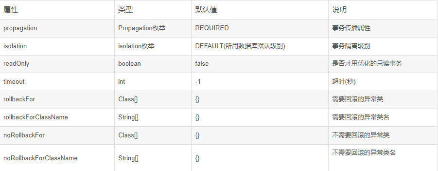
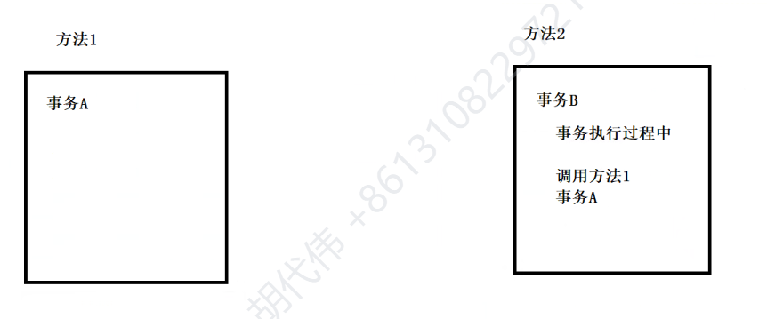

Spring的声明式事务管理——XML方式：思想就是AOP

基于xml配置文件的方式来进行声明式事务的操作，不需要进行手动编写代码，通过一段配置完成事务管理。下面我们在以上案例的基础上实现它。

1）配置事务管理器
我们已经讲过Spring针对不同的持久化框架，提供了不同PlatformTransactionManager接口的实现类：
org.springframework.jdbc.datasource.DataSourceTransactionManager ：使用 Spring JDBC或iBatis 进行持久化数据时使用
org.springframework.orm.hibernate3.HibernateTransactionManager ：使用 Hibernate版本进行持久化数据时使用
所以要在Spring配置文件中加入以下配置：

<!-- 1.配置事务的管理器 -->
```xml
<bean id="transactionManager" class="org.springframework.jdbc.datasource.DataSourceTransactionManager">
    <!-- 指定要对哪个数据库进行事务操作 -->
    <property name="dataSource" ref="dataSource"></property>
</bean>
```

2）配置事务的增强，指定对哪个事务管理器进行增强
需要在xml中引入命名空间

```xml
xmlns:tx="http://www.springframework.org/schema/tx"

http://www.springframework.org/schema/tx
http://www.springframework.org/schema/tx/spring-tx.xsd
```

配置事务的增强

<!-- 2.配置事务的增强，指定对哪个事务管理器进行增强 -->
```xml
<tx:advice id="txadvice" transaction-manager="transactionManager">
<tx:attributes>
<!--
        表示来配置你要增强的方法的匹配的一个规则，
        注意：只须改方法的命名规则，其他都是固定的！
    propagation：事务的传播行为。
-->
<tx:method name="account*" propagation="REQUIRED"></tx:method>
<!-- <tx:method name="insert*" propagation="REQUIRED"></tx:method> -->
</tx:attributes>
</tx:advice>
```

3）配置切入点和切面
```xml
<!-- 3.配置切入点和切面(最重要的一步) -->
<aop:config>
<!-- 切入点 -->
<aop:pointcut expression="execution(* com.oak.service.AccountService.*(..))" id="pointcut"/>
<!-- 切面，即表示把哪个增强用在哪个切入点上 -->
<aop:advisor advice-ref="txadvice" pointcut-ref="pointcut"/>
</aop:config>
```

<tx:method >的属性详解


readOnly
事务属性中的readOnly标志表示对应的事务应该被最优化为只读事务。如果值为true就会告诉Spring我这个方法里面没有insert或者update，你只需要提供只读的数据库Connection就行了，这种执行效率会比read-write的Connection高，所以这是一个最优化提示。在一些情况下，一些事务策略能够起到显著的最优化效果，例如在使用Object/Relational映射工具（如：Hibernate或TopLink）时避免dirty checking（试图“刷新”）。

timeout
在属性中还有定义“timeout”值的选项，指定事务超时为几秒。一般不会使用这个属性。在JTA中，这将被简单地传递到J2EE服务器的事务协调程序，并据此得到相应的解释。

Isolation Level(事务隔离等级)的5个枚举值
为什么事务要有Isolation Level这个属性？先回顾下数据库事务的知识：
第一类丢失更新(lost update)：在完全未隔离事务的情况下，两个事物更新同一条数据资源，某一事物异常终止，回滚造成第一个完成的更新也同时丢失。
第二类丢失更新(second lost updates)：是不可重复读的特殊情况，如果两个事务都读取同一行，然后两个都进行写操作，并提交，第一个事务所做的改变就会丢失。
脏读(dirty read)：如果第二个事务查询到第一个事务还未提交的更新数据，形成脏读。因为第一个事务你还不知道是否提交，所以数据不一定是正确的。
虚读(phantom read)：一个事务执行两次查询，第二次结果集包含第一次中没有或者某些行已被删除，造成两次结果不一致，只是另一个事务在这两次查询中间插入或者删除了数据造成的。
不可重复读(unrepeated read)：一个事务两次读取同一行数据，结果得到不同状态结果，如中间正好另一个事务更新了该数据，两次结果相异，不可信任。


当遇到以上这些情况时我们可以设置isolation下面这些枚举值：
DEFAULT：采用数据库默认隔离级别
SERIALIZABLE：最严格的级别，事务串行执行，资源消耗最大；
REPEATABLE_READ：保证了一个事务不会修改已经由另一个事务读取但未提交（回滚）的数据。避免了“脏读取”和“不可重复读取”的情况，但是带来了更多的性能损失。
READ_COMMITTED:大多数主流数据库的默认事务等级，保证了一个事务不会读到另一个并行事务已修改但未提交的数据，避免了“脏读取”。该级别适用于大多数系统。
READ_UNCOMMITTED：保证了读取过程中不会读取到非法数据。隔离级别在于处理多事务的并发问题。


什么是事务传播行为？

当一个事务方法被其他事务方法调用时该如何处理


关于propagation属性的7个传播行为
REQUIRED：指定当前方法必需在事务环境中运行，如果当前有事务环境就加入当前正在执行的事务环境，如果当前没有事务，就新建一个事务。这是默认值。
SUPPORTS：指定当前方法加入当前事务环境，如果当前没有事务，就以非事务方式执行。
MANDATORY：指定当前方法必须加入当前事务环境，如果当前没有事务，就抛出异常。
REQUIRES_NEW：指定当前方法总是会为自己发起一个新的事务，如果发现当前方法已运行在一个事务中,则原有事务被挂起,我自己创建一个属于自己的事务,直我自己这个方法commit结束,原先的事务才会恢复执行。
NOT_SUPPORTED：指定当前方法以非事务方式执行操作，如果当前存在事务，就把当前事务挂起，等我以非事务的状态运行完，再继续原来的事务。
NEVER：指定当前方法绝对不能在事务范围内执行，如果方法在某个事务范围内执行，容器就抛异常，只有没关联到事务，才正常执行。
NESTED：指定当前方法执行时，如果已经有一个事务存在,则运行在这个嵌套的事务中.如果当前环境没有运行的事务，就新建一个事务，并与父事务相互独立，这个事务拥有多个可以回滚的保证点。就是指我自己内部事务回滚不会对外部事务造成影响，只对DataSourceTransactionManager事务管理器起效。